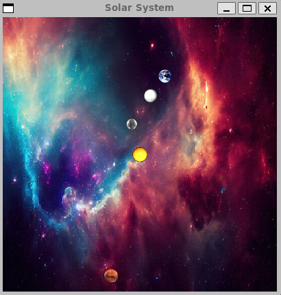

# Solar-Simulation :earth_americas:
 
created by: Brandon Nguyen



## Summary :pencil2:

This project demonstrates an example of our solar system that takes in user input to dynamically generate and simulate celestial bodies.
The application serves as an interactive model of our solar system, allowing users to input specific parameters and observe the resulting gravitational interactions and orbital movements. Through this application, users can gain insights into the dynamic relationships between celestial bodies, exploring the impact of various factors such as mass and position on the overall structure and behavior of the simulated solar system.

## Features :tada:

Solar System Generator application in C++ leveraging the SFML library, providing users with a dynamic platform to simulate and visually explore celestial bodies within a virtual solar system. Crafted a sophisticated physics engine that accurately models gravitational interactions, considering factors such as mass and position to simulate realistic celestial dynamics. The application features an intuitive user interface, empowering users to customize attributes of celestial bodies and observe real-time visualizations of their influence on the overall solar system. This project merges scientific accuracy with user-friendly design, offering a comprehensive and engaging exploration of celestial mechanics

## Build :hammer_and_wrench:

Clone the repository:

```
git clone https://github.com/ThatGuyHieu/Solar-Simulation.git
cd Solar-Simulation
make
```

## Run :runner:

```
./NBody 157788000.0 25000.0 < planets.txt
```